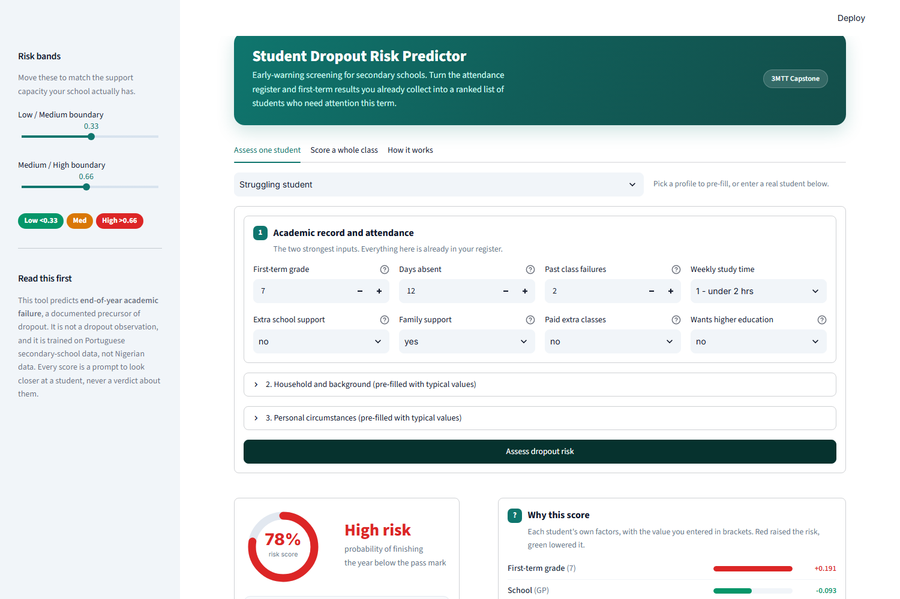
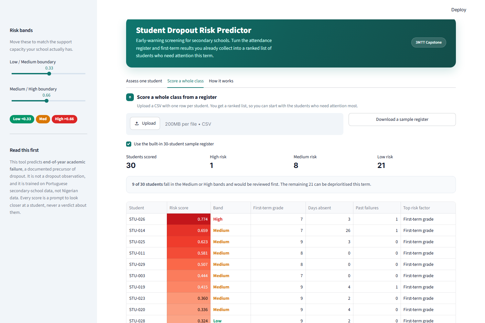

# Student Dropout Risk Predictor for Secondary Schools

**3MTT Capstone Project | Nigeria**

A machine learning early-warning tool that scores a secondary-school student's risk of
finishing the year below the pass mark, places them in a Low / Medium / High band, and shows
the teacher exactly which factors drove that score.

Every number in this README was produced by running [notebook.ipynb](notebook.ipynb). Nothing
is estimated or copied from a paper. The notebook in this repository is saved with its
outputs, so each figure can be traced to the cell that produced it.

```
notebook.ipynb         full pipeline, executed, with outputs and 44 passing assertions
app.py                 Streamlit app for teachers
models/                saved pipeline (preprocessing + SMOTE + RandomForest) via joblib
evaluation/            model_comparison.csv, metrics.json, and 14 plots
data/                  UCI CSVs plus download_data.py
scripts/               build_notebook.py, and the verification scripts below
requirements.txt       pinned versions
```

Three checks can be run at any time to confirm the repository is internally consistent:

```bash
python scripts/verify_repo.py       # files present, notebook clean, docs match metrics.json,
                                    # leakage guarantees hold, no em dashes
python scripts/verify_notebook.py   # every cell executed, every assertion passed
python scripts/test_app.py          # drives app.py through Streamlit's test harness and
                                    # asserts each sample profile renders a band plus factors
```

`verify_repo.py` re-reads `evaluation/metrics.json` and asserts that each headline number
quoted in this README matches it, so the documentation cannot silently
drift away from the results.

---

## Problem

Nigeria carries one of the largest out-of-school populations in the world. UNESCO and UNICEF
estimates put the figure at roughly 10 to 20 million children, and the transition from junior
to senior secondary is one of the points where students are most likely to leave. The drivers
are well documented: household poverty and the opportunity cost of staying in school, distance
to school, early marriage, insecurity and displacement in parts of the north, and academic
failure that forces a student to repeat a year.

Schools usually notice too late. A student's attendance slips, their marks fall, and by the
time anyone reacts the student has already gone. Attendance registers and termly grades are
already collected in almost every school, which means the raw material for an early-warning
system exists. What is missing is the step that turns those records into a ranked list of
students who need attention **this term**, while a teacher can still act.

This project builds that step:

- takes attendance, first-term grades, and household background for one student
- returns a **risk band** (Low, Medium, High) with a probability
- returns the **top contributing factors** for that specific student, not just a global ranking
- is tuned so that **missing an at-risk student is treated as far more costly** than flagging a
  student who turns out to be fine

---

## Data

### Source

UCI Machine Learning Repository, **Student Performance** (Cortez and Silva, 2008).
<https://archive.ics.uci.edu/dataset/320/student+performance>

Secondary-school students from two Portuguese schools, surveyed with school reports and
questionnaires. Two files: `student-por.csv` (Portuguese language, 649 students) and
`student-mat.csv` (Mathematics, 395 students). Both carry `absences` (attendance) and `G1`,
`G2`, `G3` (period grades), which is precisely what this project needs.

Get it with `python data/download_data.py`, or let the notebook fetch it automatically.

### Why not a Nigerian dataset

The brief asked for a real Nigerian or African secondary-school dataset with an actual dropout
or enrolment outcome, to be preferred if one could be found quickly. **We searched and did not
find one.** The nearest public options were:

- UCI *Predict Students Dropout and Academic Success*: Portuguese, and **higher education**,
  not secondary, with no attendance column
- a Nigerian dataset of **tertiary** GPA and ethnicity from a private university
- national and state-level aggregate enrolment statistics, which have no student-level rows

Aggregate statistics cannot train a per-student classifier, and tertiary data does not
describe secondary-school attendance. So this model is trained on Portuguese secondary schools.
That is a real limitation and it is repeated in the Limitations section rather than buried.
The pipeline is written so that a Nigerian dataset with the same columns can be dropped
straight in.

### Data-integrity check performed before modelling

The UCI documentation notes that some students appear in both files. The notebook verifies
this rather than trusting it:

| Check | Result |
|---|---|
| Students matched across both files | **382** (matches the UCI documentation exactly) |
| Mathematics-only students | 25 |
| Naive concatenation | 1,044 rows for only 674 distinct students |

Concatenating the two CSVs would put **382 students in both the training set and the test
set**. That is leakage, and it is the easiest way to accidentally report a fake score. We
therefore model on the **Portuguese cohort alone, n = 649**. The 25 Mathematics-only students
were left out because their label would mean "failed Mathematics" while the other 649 mean
"failed Portuguese", and mixing two subject definitions into one target to gain 3.7% more rows
is a bad trade for a label this sensitive.

The cohort has **no missing values** in any of its 33 columns.

### The proxy target, stated plainly

There is no dropout column in this data. We construct one:

> **`at_risk = 1` if the student's final grade `G3` is below the pass mark of 10 out of 20,
> otherwise `0`.**

This yields **100 at-risk students out of 649, a rate of 15.4%**.

**What this means.** A student who ends the year below the pass mark does not progress and
must repeat. Grade repetition is one of the most consistently documented antecedents of
dropout in secondary education, including in Nigerian and wider West African settings:
repeating pushes a student off the age-for-grade track, raises the direct and opportunity cost
of continuing, and sharply raises the chance of leaving. So this target identifies **the
population a dropout-prevention programme would want to reach**, which is the operational
question a school actually faces.

**What this does not mean.** It is not a dropout observation.

- A student flagged here failed the year. Most such students do **not** drop out.
- A student who leaves for reasons unrelated to grades, such as early marriage, a family
  income shock, or displacement, is **completely invisible** to this label.

The honest one-line description: *this model predicts end-of-year academic failure, a
documented precursor of dropout, and is used as a screening signal for support.*

### Leakage decisions, feature by feature

The label is built from `G3`, so what the model may see has to be decided deliberately. Every
include and exclude is justified below.

| Feature | Decision | Justification |
|---|---|---|
| `G3` final grade | **Exclude** | The target is a function of it. Including it is definitional leakage. |
| `G2` second-period grade | **Exclude** | Not part of the label, but `corr(G2, G3) = 0.919`. A model built on it degenerates into "G2 restated", crowding out the attendance and household signals that make the tool useful for *targeting support*. It also only arrives near the end of the year, when there is little time left to intervene. Excluding it is a deliberate cost paid for actionability. |
| `G1` first-period grade | **Include** | `corr(G1, G3) = 0.826`, but it is a genuinely **earlier measurement**, available after the first term with two terms left to act. Predicting an end-of-year outcome from first-term performance is the standard early-warning setup. |
| `absences` | **Include** | Attendance is central to the brief and to real early-warning systems. See the caveat below. |
| `failures` past class failures | **Include** | Refers to failures in *prior* years, known at enrolment. |
| Household and background (24 features) | **Include** | All known at enrolment. Several are socioeconomic proxies, which is addressed under Ethics. |

That leaves **31 raw features, expanding to 40 after one-hot encoding**.

**Caveat on `absences`.** The dataset records absences as a single whole-year total, so it is
contemporaneous with `G3` rather than strictly prior to it. This is not leakage, because the
label is not derived from absences, but it does flatter the deployment story: a real school
would have absences-to-date, not the year-end figure. The app therefore asks for "days missed
so far this term".

---

## Approach

1. **Load and validate.** Shapes, dtypes, null counts, class balance, and the 382-student
   overlap check, each with an assertion that names its own failure cause.
2. **EDA.** Distributions of attendance and grades, their relationship to the target,
   correlation structure, and at-risk rates across household features. 14 plots saved.
3. **Preprocess.** Standardise numeric features, one-hot encode categoricals with
   `handle_unknown="ignore"` so the deployed app cannot crash on an unseen value, then a
   **stratified** 80/20 split: **519 students for training** (80 at risk) and **130 held out**
   (20 at risk). Stratification holds the positive rate to 15.41% in train and 15.38% in test.
4. **Handle imbalance with SMOTE placed inside the pipeline.** This matters. Because SMOTE is
   a step in an `imblearn` pipeline, it is refitted on the training portion of **each
   cross-validation fold only**. Oversampling before the split, a very common error, leaks
   synthetic copies of training students into the validation fold and inflates every score.
   The test set is never resampled and keeps its real 15.4% prevalence.

   | | Not at risk | At risk | Ratio |
   |---|---|---|---|
   | Training set before SMOTE | 439 | 80 | 1 : 5.49 |
   | Training set after SMOTE | 439 | 439 | 1 : 1.00 |
   | Test set (untouched) | 110 | 20 | 15.38% prevalence |

5. **Train four models** with 5-fold stratified cross-validation: LogisticRegression as the
   interpretable baseline, DecisionTree, RandomForest, GradientBoosting.
6. **Evaluate** on accuracy, precision, recall, F1, ROC-AUC, PR-AUC, and confusion matrices,
   then tune the decision threshold.
7. **Explain** with built-in importance, permutation importance, and SHAP.
8. **Save** the whole pipeline with joblib for the app.

### On neural networks

None was added, and that is a deliberate choice rather than an omission. With 649 rows and 40
encoded features, a TensorFlow or Keras model would almost certainly lose to gradient boosting
while adding a heavy dependency, a longer training loop, and worse explainability. Tree
ensembles are the right tool for small tabular data. The brief permitted a neural net only if
it clearly beat the tree ensembles, and there was no reason to expect that here.

---

## How to run

### Google Colab

1. Upload `notebook.ipynb` to [Colab](https://colab.research.google.com/).
2. Run all cells. The first cell installs anything missing, and the data cell downloads the
   UCI archive automatically. No manual setup.
3. Total runtime is a couple of minutes on a free CPU instance. No GPU needed.

### Local

```bash
git clone <your-repo-url>
cd "capstone project"

python -m venv .venv
source .venv/bin/activate        # Windows: .venv\Scripts\activate

pip install -r requirements.txt
python data/download_data.py     # optional, the notebook does this too

jupyter notebook notebook.ipynb  # run all cells to regenerate models/ and evaluation/
streamlit run app.py             # launch the teacher-facing app
```

The app opens at <http://localhost:8501>. It needs `models/dropout_risk_model.joblib`, which
the notebook's final section writes, and it tells you so explicitly if the file is missing.

### The app



Three tabs: assess one student, score a whole class from a register CSV, and model
documentation. The risk gauge, band, and factor breakdown update together, and each factor
is labelled with the value the teacher entered.



Batch mode ranks a class highest risk first, so a school can start at the top of the list.
The screenshots above are produced by `python scripts/screenshot_app.py`, which renders the
running app in headless Chromium and asserts the styling actually applied.

### Deploy free on Streamlit Community Cloud

1. Push this repo to GitHub, **including** `models/dropout_risk_model.joblib` (about 1 MB, so
   it fits comfortably in a normal Git repo with no need for Git LFS).
2. Sign in at <https://share.streamlit.io> with GitHub.
3. Select **New app**, choose the repo and branch, set the main file to `app.py`.
4. Select **Deploy**. The build installs `requirements.txt` and the app goes live at
   `https://<your-app-name>.streamlit.app`.

Two things that commonly break this deployment: forgetting to commit the model file, and
leaving `requirements.txt` unpinned so a newer scikit-learn refuses to unpickle the model. Both
are handled here.

### Deploy free on Hugging Face Spaces

1. Create a Space at <https://huggingface.co/new-space>, pick **Streamlit** as the SDK and the
   free CPU basic hardware.
2. Push this repo to the Space:
   ```bash
   git remote add space https://huggingface.co/spaces/<username>/<space-name>
   git push space main
   ```
3. Spaces looks for `app.py` and `requirements.txt` at the repository root, which is where they
   are. The Space builds and starts on its own.

---

## Results

All figures below are on the **held-out test set of 130 students, 20 of them genuinely at
risk**, which the model never saw during training or selection.

### Model comparison

Cross-validated columns are 5-fold means on the training set. Test columns are at the default
0.50 threshold.

| Model | CV recall | CV F1 | CV ROC-AUC | CV PR-AUC | Test recall | Test precision | Test F1 | Test ROC-AUC | Test PR-AUC | Missed (FN) |
|---|---|---|---|---|---|---|---|---|---|---|
| **RandomForest** | 0.700 | 0.716 | **0.947** | **0.753** | 0.700 | 0.560 | 0.622 | 0.891 | 0.581 | 6 |
| GradientBoosting | 0.663 | 0.663 | 0.938 | 0.728 | 0.650 | 0.591 | 0.619 | 0.886 | 0.516 | 7 |
| LogisticRegression | 0.700 | 0.624 | 0.922 | 0.676 | 0.850 | 0.515 | 0.642 | 0.891 | 0.606 | 3 |
| DecisionTree | 0.675 | 0.668 | 0.892 | 0.630 | 0.850 | 0.567 | 0.680 | 0.877 | 0.556 | 3 |

Full table: [evaluation/model_comparison.csv](evaluation/model_comparison.csv). Machine-readable
metrics: [evaluation/metrics.json](evaluation/metrics.json).

**Selection rule: highest cross-validated PR-AUC, with the test set left untouched.**
RandomForest won at 0.753.

**An honest note on this choice.** LogisticRegression scored *better* on the test set than
RandomForest at the default threshold (recall 0.850 against 0.700, PR-AUC 0.606 against 0.581).
We did not switch to it, because picking a model by looking at the test set is exactly how
reported scores stop meaning anything. The selection was made on cross-validated training-fold
performance, which is the methodologically correct basis, and the ranking is reported as it
fell. With only 20 positive cases in the test set, a gap of three students moves recall by 0.15,
so these test differences are well inside the noise. After threshold tuning, described next,
RandomForest reaches the same 0.850 recall anyway.

### Why recall on the at-risk class is the headline metric

The two errors are not equal.

- **False negative:** a genuinely at-risk student is scored Low and receives nothing. The
  student is failed by the very system meant to catch them. This is the cost the project exists
  to reduce.
- **False positive:** a student who was going to be fine is flagged and gets a conversation
  with a teacher, an attendance check, perhaps some extra tuition. The cost is a share of a
  teacher's time, and the intervention itself does no harm.

These costs differ by roughly an order of magnitude, so we optimise **recall on the at-risk
class** and read precision as the budget constraint: it tells the school how many flagged
students will turn out not to have needed help. **PR-AUC** is reported alongside ROC-AUC
because ROC-AUC is optimistic under class imbalance.

### Threshold tuning

The default 0.50 cutoff assumes both errors cost the same. We swept the threshold and chose the
operating point with the **highest precision among those reaching recall of at least 0.85**.

**Selected threshold: 0.42**

| | Threshold 0.50 | **Threshold 0.42 (selected)** |
|---|---|---|
| Accuracy | 0.869 | **0.877** |
| Precision | 0.560 | **0.567** |
| **Recall (at-risk)** | 0.700 | **0.850** |
| F1 | 0.622 | **0.680** |
| ROC-AUC | 0.890 | 0.890 |
| PR-AUC | 0.581 | 0.581 |
| Confusion matrix (TN / FP / FN / TP) | 99 / 11 / 6 / 14 | **97 / 13 / 3 / 17** |

Lowering the threshold from 0.50 to 0.42 cut the number of **at-risk students missed from 6 to
3 out of 20**, at a cost of two extra false positives. Three additional students identified for
two extra conversations is a good trade, and it is the trade the whole project is about. Note
that accuracy went **up** as well, so nothing was given away for this.

### Headline result

**RandomForest at threshold 0.42, on 130 held-out students:**

| Metric | Value |
|---|---|
| **Recall (at-risk class)** | **0.850** |
| Precision | 0.567 |
| F1 | 0.680 |
| Accuracy | 0.877 |
| ROC-AUC | 0.890 |
| PR-AUC | 0.581 |
| At-risk students missed | **3 of 20** |

### Risk bands

Bands are configurable, and adjustable live in the app sidebar. Defaults: Low below 0.33,
Medium from 0.33 to 0.66, High above 0.66.

| Band | Students | Share of cohort | Actually at risk | Precision within band |
|---|---|---|---|---|
| Low | 92 | 70.8% | 3 | 0.033 |
| Medium | 32 | 24.6% | 13 | 0.406 |
| High | 6 | 4.6% | 4 | 0.667 |

**17 of the 20 genuinely at-risk students land in Medium or High**, which is the number that
matters operationally: a school reviewing the top two bands reviews 38 students out of 130 and
reaches 85% of the students who needed help. The Low band is 70.8% of the cohort and contains
just 3.3% at-risk students, so it can be safely deprioritised.

### Key plots

All 14 are in [evaluation/plots/](evaluation/plots/).

| Plot | What it shows |
|---|---|
| [01_target_and_inputs.png](evaluation/plots/01_target_and_inputs.png) | Class balance and where the label cuts the grade distribution |
| [02_attendance_grades_vs_target.png](evaluation/plots/02_attendance_grades_vs_target.png) | Attendance and first-term grade against the target |
| [03_correlations.png](evaluation/plots/03_correlations.png) | Correlation structure, including the case against `G2` |
| [05_roc_pr_curves.png](evaluation/plots/05_roc_pr_curves.png) | ROC and precision-recall curves for all four models |
| [07_threshold_tuning.png](evaluation/plots/07_threshold_tuning.png) | The recall / precision trade-off and its caseload cost |
| [09_feature_importance.png](evaluation/plots/09_feature_importance.png) | Built-in and permutation importance side by side |
| [10_shap_summary.png](evaluation/plots/10_shap_summary.png) | Global SHAP summary |
| [12_shap_single_student.png](evaluation/plots/12_shap_single_student.png) | One student's explanation |
| [14_sensitivity.png](evaluation/plots/14_sensitivity.png) | How far each input can actually move the score |

---

## Explainability

Three complementary views, because a risk score a teacher cannot interrogate is not usable and,
worse, invites blind trust.

### Global: permutation importance

Measured on the held-out test set as the drop in PR-AUC when a feature is shuffled. This is the
more trustworthy global view because it reflects real predictive contribution rather than how
often a tree happened to split on something.

| Rank | Feature | Drop in PR-AUC |
|---|---|---|
| 1 | `G1` first-term grade | 0.287 |
| 2 | `higher` wants higher education | 0.036 |
| 3 | `activities` extra activities | 0.031 |
| 4 | `school` | 0.029 |
| 5 | `age` | 0.014 |
| 6 | `traveltime` | 0.014 |
| 7 | `Walc` weekend alcohol use | 0.012 |
| 8 | `freetime` | 0.011 |
| 9 | `Dalc` weekday alcohol use | 0.010 |
| 10 | `guardian` | 0.010 |

`G1` dominates by roughly a factor of eight. **`absences` ranks 20th of 31.**

### Sensitivity: what a teacher would actually see

Importance rankings say which features the model *uses*. This says what happens when a teacher
changes one box in the app. Holding a modal student fixed and sweeping one feature at a time:

| Feature | Range swept | Score swing |
|---|---|---|
| `G1` first-term grade | 4 to 18 | **0.437** |
| `failures` past class failures | 0 to 3 | 0.193 |
| `absences` days missed | 0 to 32 | **0.031** |
| `studytime` | 1 to 4 | 0.008 |

This is the most uncomfortable result in the project and it is reported here rather than
softened. **Moving a student's attendance across its entire observed range, from perfect to 32
days missed, changes the predicted risk by 0.031.** The first-term grade alone moves it by
0.437. The app asks for attendance because attendance belongs in an early-warning system and a
Nigerian deployment would very likely find it matters more, but in *this* dataset it is doing
very little work. See Limitations.

### Per-student: SHAP

This is what the app renders for a teacher. Real output for the highest-risk student in the
test set (student 512, predicted 0.840, **High** band, and genuinely at risk):

Inputs: `G1 = 7`, `absences = 9`, `failures = 1`, `studytime = 2`, `Medu = 1`, `Fedu = 1`

| Factor | Contribution | Direction |
|---|---|---|
| `G1` first-term grade | +0.209 | raises risk |
| `failures` past class failures | +0.083 | raises risk |
| `school` | +0.078 | raises risk |
| `Walc` weekend alcohol use | -0.025 | lowers risk |
| `Fedu` father's education | +0.024 | raises risk |
| `studytime` | -0.018 | lowers risk |
| `higher` wants higher education | -0.014 | lowers risk |

A teacher reads this as: *this student is High risk mainly because they scored 7 out of 20 in
the first term and have already failed a class before. Their stated intention to continue to
higher education is the one thing working in their favour.* That is an actionable conversation,
which a bare probability is not.

---

## Ethics and fairness

This tool makes predictions about children using their family's socioeconomic circumstances.
That demands care, and the following are design constraints, not aspirations.

### Human in the loop, always

The output is **a prompt for a teacher to look more closely at a student**. It is not a
decision and it must never become one. Specifically, this tool must **never** be used to:

- stream, set, or segregate students into lower tiers
- deny admission, re-enrolment, or progression
- justify writing a student off, or lower what is expected of them
- appear on a student's permanent record

The only legitimate output is **more attention and more support** directed at a flagged
student. If an institution cannot commit to that, it should not deploy this.

### Bias risk from socioeconomic proxies

Several features are direct proxies for household wealth and status: `Medu` and `Fedu`
(parents' education), `Mjob` and `Fjob`, `internet` at home, `traveltime`, `address` (urban or
rural), and `paid` extra classes. A model trained on these will learn that poorer students are
higher risk, because in the data they are.

This creates a real feedback risk. If a school treats a High band as a signal about a student's
*potential* rather than their *present need for support*, the tool will systematically lower
expectations for poor students. That is the opposite of the intent, and it would be worse than
having no tool at all.

Mitigations built in here:

- Feature contributions are shown for every prediction, so a teacher can see when a score is
  being driven by a student's postcode rather than their work. The app labels the household
  section with exactly that warning.
- Risk bands are adjustable, so a school can set them against the support capacity it actually
  has instead of flagging more students than it can help.
- `G1`, the dominant feature at roughly eight times the next, is an **academic** signal, not a
  socioeconomic one. This is worth stating: the model is not mainly a wealth detector.

Mitigations **not** implemented, and needed before real deployment:

- **No subgroup fairness audit was run.** Recall was not compared across sex, urban versus
  rural address, or parental education. This is the most significant ethical gap in the project.
  The dataset lacks the ethnicity, religion, and region variables that would matter most in
  Nigeria, so a proper audit needs Nigerian data. It is the first item under Future work.

### Data protection

Student records are sensitive personal data and, in Nigeria, fall under the **Nigeria Data
Protection Act 2023**. The app holds nothing: inputs are typed in, scored in memory, and gone
when the page closes. There is no database, no logging, and no student identifiers. Any real
deployment adding storage would need consent, a retention policy, and access controls.

### Be honest with students and families

If a student is flagged, the conversation should be about the support on offer, not about an
algorithm's verdict. Students and guardians should be able to ask why a student was flagged,
and the SHAP factors exist so that question has a real answer.

---

## Limitations

Ordered by how much they should change your reading of the results.

1. **The target is a proxy, not observed dropout.** `at_risk = G3 < 10` measures end-of-year
   academic failure. It is a documented precursor of dropout, not dropout. Most students who
   fail a year do not leave school, and students who leave for reasons unrelated to grades,
   including early marriage, income shocks, and displacement, are invisible to this label.
   **No claim is made that this model predicts dropout.**

2. **The data is Portuguese, not Nigerian.** No public student-level Nigerian secondary-school
   dataset with a dropout outcome was found. The socioeconomic drivers of dropout in Nigeria
   differ substantially from those in Portugal. **The transferable artefact is the pipeline,
   not the fitted weights.** Retrain on local data before deploying anywhere.

3. **Attendance barely moves this model.** Sweeping `absences` across its full 0 to 32 range
   shifts the predicted risk by 0.031, and it ranks 20th of 31 features. The at-risk rate does
   rise with absences, from 13.9% at zero to 24.5% at 11 or more days, so the signal is real
   but weak, and prior academic performance swamps it. A likely cause is that this dataset
   records absences as one whole-year total rather than term by term, which hides exactly the
   pattern that matters, a student whose attendance is *deteriorating*. This is the single
   biggest thing a Nigerian dataset with termly registers would likely fix.

4. **The test set is small.** 130 students, 20 of them at risk. One student moves recall by
   0.05. Treat every metric here as carrying an uncertainty band of several points, and treat
   differences between the four models as mostly noise.

5. **No subgroup fairness audit.** Performance was not broken down by sex, address type, or
   parental education. Aggregate recall of 0.850 could conceal materially worse performance for
   a subgroup.

6. **`absences` is contemporaneous with the label.** It is a whole-year total, so it is not
   strictly prior to `G3`. This is not leakage, since the label is not derived from it, but a
   real school would have absences-to-date and the model would see a slightly weaker signal.

7. **Single train/test split.** Model selection used cross-validation, but final metrics come
   from one 80/20 split. Repeated splits or nested cross-validation would give proper
   confidence intervals.

8. **Precision of 0.567 means roughly four in ten flagged students were not at risk.** With the
   threshold at 0.42 the school reviews 30 students to reach 17 who need help. That is
   deliberate and correct given the cost asymmetry, but it is real staff time and a school
   should budget for it.

---

## Future work

Ordered by expected impact.

1. **Get Nigerian data.** Partner with a state ministry of education or an NGO running school
   programmes to obtain student-level records with **termly attendance** and an **actual
   enrolment outcome** the following year. This addresses limitations 1, 2, and 3 at once and
   is worth more than any modelling improvement.
2. **Run a subgroup fairness audit.** Report recall, precision, and calibration separately by
   sex, urban versus rural, and household wealth proxies. Add region, and language or ethnicity
   where lawful and consented, for a Nigerian deployment.
3. **Use attendance as a trend, not a total.** Term-by-term or monthly registers allow features
   such as *change* in attendance and consecutive-absence streaks, which is what actually
   signals a student disengaging.
4. **Calibrate the probabilities.** Apply Platt scaling or isotonic regression so that a score
   of 0.42 genuinely means a 42% chance. Bands are only defensible if the underlying
   probabilities are calibrated.
5. **Validate against a real outcome.** Run the model prospectively for one academic year and
   compare its flags to who actually left. Until this happens, the proxy target is an
   assumption, not a finding.
6. **Add cost-sensitive learning.** Replace the manual threshold sweep with an explicit
   cost matrix agreed with the school, so the operating point follows from a stated policy.
7. **Support batch scoring.** A teacher should be able to upload a class register as CSV and
   get a ranked list, rather than typing students in one at a time.
8. **Repeated or nested cross-validation** for proper confidence intervals on every metric.

---

## Attribution

Dataset: Cortez, P. and Silva, A. (2008). *Using Data Mining to Predict Secondary School Student
Performance*. In Brito, A. and Teixeira, J. (eds.), Proceedings of 5th FUture BUsiness
TEChnology Conference, pp. 5 to 12. UCI Machine Learning Repository,
<https://archive.ics.uci.edu/dataset/320/student+performance>. Licensed CC BY 4.0.

Built for the 3MTT programme, Nigeria.
